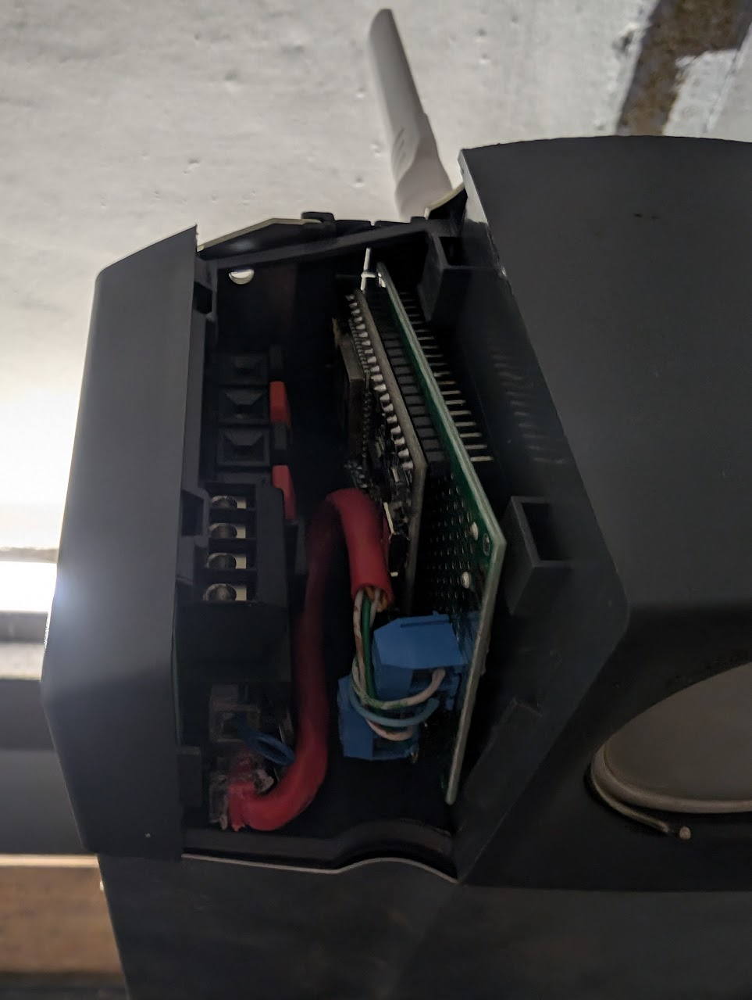
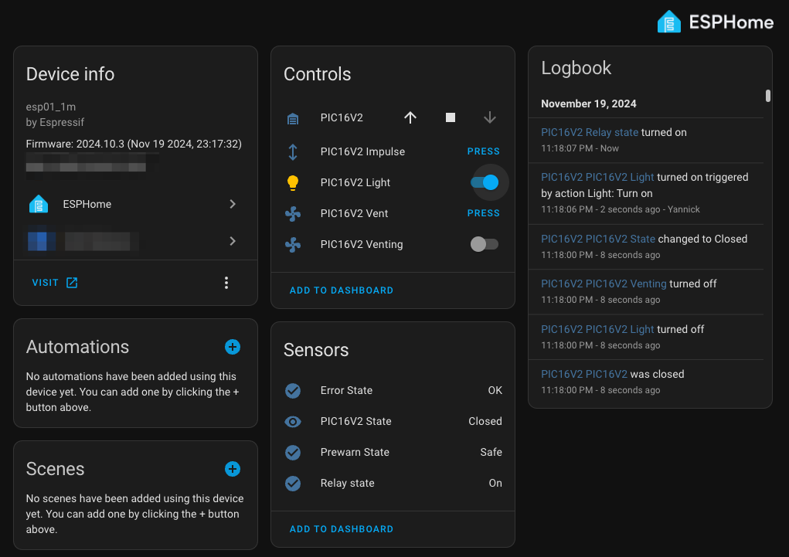

# Hörmann Door Drive Controller  
Control Hörmann door drives directly via ESPHome. 🚪✨  
This project emulates a UAP1 and provides a seamless way to integrate Hörmann door drives, such as the Supramatic E3, into Home Assistant.  

⚠️ **Use at your own risk!**  

---

## 🚨 Breaking Change Notice  

**Thanks to @Rezoran** for porting this project to hardware without a PIC16 microcontroller!  
The platform for common components has been renamed from `uapbridge_pic16` to `uapbridge`.  

### Update Required:  
Updating form previous version you need to update your ESPHome YAML configuration. See also the recommended_pic16.yaml. 

#### Example Change:  

Before:  
```yaml
cover:
  - platform: uapbridge_pic16
    name: ${friendly_name}
    device_class: garage
```
After:
```yaml
cover:
  - platform: uapbridge
    name: ${friendly_name}
    device_class: garage
```
---

## Overview  

This repository includes:  
- PCB designs.  
- Firmware for an interface device that emulates a Hörmann UAP1.  
- ESPHome configuration to integrate your door drive into Home Assistant.  
- Optional support for the BME280 sensor to measure temperature, humidity, and pressure.  

**Note:** This solution is NOT compatible with 4th series drives.  

---

## Features  

- Emulates Hörmann UAP1 for seamless control.  
- Supports two variants:  
  1. **Prebuilt PCB with PIC16 MCU.**  
  2. **ESP32 with RS485 Transceiver.**  
- Backward compatibility with older PIC16 firmware.  

---

## Getting Started  

### Variant 1: Prebuilt PCB with PIC16 MCU  

<p align="center">  
      
      
</p>  

- **Ready-made solution:** Get a fully assembled PCB from [Tindie](https://www.tindie.com/products/14yannick/uapbridge_pic16/).  
    - Preflashed with PIC16 v2 firmware for "Soft Stop" and "Impulse" commands.  
- **Build your own:** Assemble a PCB using files in the `board` folder.  
    - Optionally, add a BME280 sensor for environmental data.  

### Variant 2: ESP32 with RS485 Transceiver  

<p align="center">  
      
      
</p>  

- Build a PCB with an RS485 transceiver.  
- Adjust ESPHome configuration using provided examples.  
- Install ESPHome firmware using the [ESPHome Web tool](https://web.esphome.io/).  
- Perform OTA updates via your ESPHome instance.  

---

## ESPHome Integration  

This repo includes ESPHome configurations for both variants:  

1. **PIC16 Variant**  
    - [Preflashed Configuration](esphome/preflashed_pic16.yaml)  
    - [Recommended Configuration](esphome/recommended_pic16.yaml)  

    <p align="center">  
          
    </p>  

    **Compatibility Note:** Use the `pic16_version` parameter to ensure compatibility with older PIC16 firmware:  
    - `pic16_version: 2` for "Soft Stop" support.  
    - `pic16_version: 1` for older firmware, using "Emergency Stop" instead.  

2. **ESP32 with RS485 Variant**  
    - [ESP and RS485 Configuration](esphome/recommended_esp.yaml)  

---

## Legacy Arduino MQTT Build  

The original project used an Arduino sketch for MQTT-based integration with Home Assistant.  
This legacy code is no longer maintained but can be found [here](https://github.com/stephan192/hoermann_door).  

---

## Folder Structure  

- **`board`**: Eagle schematic and PCB design files.  
- **`docs`**: Documentation and images.  
- **`pic16`**: MPLabX project files for the PIC16.  
- **`esphome`**: ESPHome components and configurations.  

---

## Step-by-Step Guide  

### For PIC16 MCU Variant  

1. **Get a PCB:**  
    - Purchase a fully assembled PCB from Tindie, or build one from the `board` folder.  

2. **Power the PCB:**  
    - Supply 24V via pins 2 & 3 of `J1`.  
    - Check 5V and 3.3V outputs.  

3. **Flash the ESP8266:**  
    - Use a USB-UART converter (e.g., CP210x).  
    - Connect the converter to `SV3` (RX, TX, GND).  
    - Short `JP1` for boot mode, power up, and reset via `JP2`.  

4. **Flash the PIC16:**  
    - Use a Microchip programmer (PICkit3, ICD3, etc.).  
    - Open the MPLabX project in the `pic16` folder.  
    - Build and program the device.  

### For ESP32 with RS485 Transceiver  

1. Build or purchase a PCB with RS485 and ESP32.  
2. Adjust the ESPHome configuration to match your hardware setup.  
3. Install the initial firmware using the [ESPHome Web tool](https://web.esphome.io/).  
4. Perform OTA updates from your ESPHome instance.  

---

## Tools Used  

### For PIC16 Variant  
- **PCB Design:** Eagle 7.2.0  
- **ESP8266 Programming:** Arduino IDE 1.8.13, USB-UART converter  
- **PIC16 Programming:** MPLabX v5.25, XC8 v2.10, PICkit3  

### For ESP32 with RS485 Variant  
- **Hardware:**  
  - ESP32 DevKit v4  
  - DC/DC 24V -> 5V Step-Down Converter  
  - RS485 Transceiver (e.g., SN65HVD72 or HW519)  

---

## Credits and Inspiration  

This project builds upon the work of many in the community:  
- [Hörmann UAP1 Analysis](https://blog.bouni.de/posts/2018/hoerrmann-uap1/)  
- [Steff393's HGDO Project](https://github.com/steff393/hgdo)  
- [Avshrs' ESP32 Hörmann Supramatic](https://github.com/avshrs/ESP32_Hormann_Supramatic_e3)  
- [Hörmann Patent](https://patents.google.com/patent/WO2005076529A1/de)  
